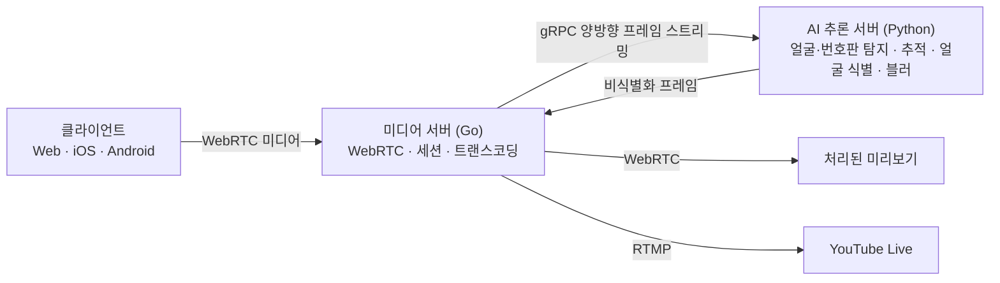

# InnoLive  
  
AI 기반 실시간 비식별화 솔루션
  
라이브 방송에서 행인의 얼굴과 차량 번호판 노출을 줄이고, 등록한 출연자의 얼굴은 비식별화 대상에서 제외합니다.
  
> [웹 체험](https://innolive.studio/) · [서비스 안내](README.md) · [English](README.en.md) · 설치 없이 브라우저에서 실행합니다.

---  
  
## 문제 정의  
  
방송 시장이 커지며 야외 방송을 하는 스트리머도 많아졌습니다. 그렇다면 그 화면에 노출되는 행인의 초상권은 어디로 갔을까요. 초상권 침해가 반복되는 원인은 스트리머 개인의 부주의가 아니라 라이브 방송이라는 구조적 한계에 있습니다.  
  
| 구조적 한계 | 내용 |  
| --- | --- |  
| 혼자서 관리하는 스트리밍 | 야외 라이브는 대부분 스트리머 혼자 진행과 촬영을 겸합니다. 방송을 이어가면서 화면에 지나가는 행인의 얼굴을 실시간으로 확인하고 대응하는 것은 물리적으로 어렵습니다 |  
| 즉시 송출되는 영상 | 촬영과 동시에 송출되므로, 문제가 되는 장면이 있어도 이미 나간 뒤라 되돌릴 수 없습니다 |  
| 2차 콘텐츠의 확산 | 송출된 영상은 다시보기, 클립, 숏폼으로 재가공되어 여러 플랫폼으로 퍼집니다. 원본을 삭제해도 잘려나간 클립까지 회수할 수는 없습니다 |  
  
대처 방법도 마땅치 않습니다. 피해자가 직접 영상을 찾아 초상권 침해임을 증명하고 민사 소송이나 손해배상 청구를 진행해야 합니다. 피해를 입은 쪽이 오히려 더 많은 시간과 노력을 들여야 하는 구조입니다.  
  
이미 법적으로 다뤄지는 문제이기도 합니다. 2025년 법원은 SNS에 타인이 등장하는 영상을 동의 없이 올린 사건에서 초상권 침해를 인정하고 위자료 200만 원을 명령했습니다. 치지직 역시 방송 가이드라인에서 동의 없는 타인의 사진·영상 게시를 제재 대상으로 규정하고 있습니다.  
  
---  
  
## 서비스 소개

InnoLive는 라이브 방송 영상의 얼굴과 차량 번호판을 AI로 탐지하고 블러 처리하는 방송 솔루션입니다. 방송인은 출연자의 얼굴을 미리 등록해 비식별화 대상에서 제외하고, 처리된 미리보기를 확인한 뒤 방송을 시작합니다.

| 기능 | 설명 |
| --- | --- |
| 얼굴·번호판 비식별화 | AI가 탐지한 얼굴과 차량 번호판 영역에 블러를 적용합니다. |
| 등록 인물 예외 처리 | 등록 인물과 일치한 얼굴만 블러 처리 대상에서 제외합니다. 이 예외는 얼굴에만 적용하며 번호판에는 적용하지 않습니다. |
| 원본·처리 화면 확인 | 방송인은 촬영 화면과 서버가 처리한 미리보기를 확인합니다. |
| YouTube 라이브 연동 | 연결한 계정으로 방송을 준비하고, 미리보기를 확인한 뒤 라이브를 시작합니다. |

### 등록 인물만 비식별화에서 제외

AI가 탐지한 미등록·미확인 얼굴과 차량 번호판을 블러 처리합니다. 얼굴 인식 결과가 등록 인물과 일치할 때 해당 얼굴을 비식별화 대상에서 제외합니다. 탐지하지 못한 영역까지 보호한다고 보장하지는 않습니다.

AI 처리에 실패하면 원본을 내보내지 않는 fail-closed 방식을 적용합니다. 얼굴 인식용 AdaFace·YuNet 모델이 없으면 탐지한 얼굴과 번호판을 계속 가리고, 등록 인물 예외 처리를 위한 얼굴 등록 요청은 거부합니다.

InnoLive는 방송인이 카메라 조작과 진행에 집중하면서 주변 인물과 번호판의 노출을 줄일 수 있도록 영상 수집, 비식별화, 미리보기, 송출을 연결합니다.

---

## 사용 흐름

1. 카메라와 마이크를 연결하고, 비식별화에서 제외할 출연자의 얼굴을 등록합니다.
2. 비식별화를 켜고 처리된 미리보기를 확인합니다.
3. YouTube 계정을 연결하고 방송 설정을 저장한 뒤 **방송 준비**를 누릅니다.
4. 준비된 화면을 확인하고 **라이브 시작**을 눌러 시청자에게 공개합니다.

앱 실행 방법과 플랫폼별 기능은 [클라이언트 안내](https://github.com/team-framework/innolive-client#빠른-실행)를 참고하세요.

---

## 기존 서비스와의 차별점  
  
실시간 비식별화를 제공하는 서비스는 이미 있지만, 대상 사용자와 기능이 다릅니다.  
  
| 항목 | ipcamlive | AXIS Communications | InnoLive |  
| --- | --- | --- | --- |  
| 대상 | IPCam | 네트워크 카메라 |  **야외 라이브 방송** |  
| 실시간 비식별화 | 제공 | 제공 | **제공** |  
| 선택적 인물 비식별화 | 미제공 | 미제공 | **제공** |  
| 방송 송출 | 제공 | 미제공 | **제공** |  
| 방송 화면 편집 | 미제공 | 미제공 | **제공**  |  
  
나머지 두 서비스는 IPCam과 네트워크 카메라를 대상으로 하므로 야외 라이브 방송에는 적합하지 않습니다. 선택적 인물 비식별화와 방송 송출에서도 차이가 있습니다.  
  
---  
  
## 아키텍처

다음은 서버에서 AI 비식별화를 수행하는 경로입니다.



1. 방송인이 출연자의 얼굴을 등록하고 카메라·마이크를 연결합니다.
2. 클라이언트가 WebSocket 시그널링으로 WebRTC 연결을 협상하고 영상과 음성을 미디어 서버에 보냅니다. STUN/TURN으로 ICE 통신 경로를 찾으며, 직접 연결이 어려우면 TURN 서버가 미디어를 중계합니다.
3. 미디어 서버가 영상 프레임을 gRPC 양방향 스트림으로 AI 서버에 전달합니다.
4. AI 서버가 YOLO 기반 세그멘테이션과 BoT-SORT로 얼굴과 번호판을 탐지·추적합니다. YuNet과 AdaFace로 등록 인물과 얼굴을 대조하고, 미등록·미확인 얼굴과 번호판을 블러 처리해 반환합니다.
5. 미디어 서버가 결과를 인코딩해 처리된 미리보기와 YouTube 라이브로 전송합니다.

iOS·Android 앱에서는 온디바이스 AI 처리도 선택할 수 있습니다. 이 모드에서는 기기가 비식별화한 영상을 서버로 보내 송출합니다. 자세한 구성은 [클라이언트 아키텍처](https://github.com/team-framework/innolive-client/blob/main/docs/architecture.md)와 [YouTube 방송 흐름](https://github.com/team-framework/innolive-client/blob/main/contracts/api/youtube-broadcast-v1.md)을 참고하세요.

세션 수 admission control(초과 시 503), 트랜스코더 동시 기동 제어, 소유자 토큰 기반 세션 하이재킹 방지가 서버에 들어가 있고, 화이트리스트는 세션 단위로 격리됩니다.  
  
---  
  
## 저장소  
  
| 저장소                                                                  | 역할                                                            | 공개  |
| -------------------------------------------------------------------- | ------------------------------------------------------------- | --- |
| [innolive-server](https://github.com/team-framework/innolive-server) | WebRTC 미디어 서버 (Go) — 세션·시그널링·트랜스코딩·AI 워커 풀·RTMP 송출            | 공개  |
| [innolive-ai](https://github.com/team-framework/innolive-ai)         | AI 추론 서버 (Python) — 얼굴·번호판 탐지·추적, 등록 인물 식별, 블러 합성 gRPC 서비스              | 공개  |
| [innolive-client](https://github.com/team-framework/innolive-client) | 웹·모바일 클라이언트 모노레포 (Web · iOS · Android, macOS·Windows는 지원 중단) | 공개  |
  
---  
  
## 사용 스택  
  
| 영역                     | 스택                                                                                                                                                             |
| ---------------------- | -------------------------------------------------------------------------------------------------------------------------------------------------------------- |
| 미디어 서버 (Go 1.25)       | `Pion WebRTC v4` · `gRPC` · `gorilla/websocket` · `GORM` + `PostgreSQL` · `golang-migrate` · `FFmpeg(libvpx / libx264 / AAC)`                                  |
| AI 추론 서버 (Python 3.12) | `Ultralytics YOLO`(세그멘테이션) · `BoT-SORT`(추적) · `AdaFace`(신원 매칭) · `YuNet`(얼굴 정렬) · `PyTorch` · `OpenCV` · `TensorRT`                                            |
| 클라이언트 · Web            | `TypeScript` · `Next.js` · `React 19` · `Tailwind CSS` · `MediaPipe Tasks Vision` · `PostgreSQL`                                                               |
| 클라이언트 · macOS (지원 중단) | `Swift` · `SwiftUI` · `AppKit` · `Combine` · `AVFoundation` · `CoreImage` · `CoreVideo` · `CoreGraphics` · `ScreenCaptureKit` · `Vision` · `WebKit` · `WebRTC` |
| 클라이언트 · Windows (지원 중단) | `C#` · `.NET 10` · `WinUI 3` · `XAML` · `WebView2` · `HttpClient` · `MVVM 패턴`                                                                                  |
| 클라이언트 · iOS            | `Swift` · `SwiftUI` · `AVFoundation` · `Apple Vision` · `Core ML` · `WebRTC` · `AuthenticationServices`                                                                                                |
| 클라이언트 · Android        | `Kotlin` · `Jetpack Compose` · `CameraX` · `WebRTC` · `ONNX Runtime` · `LiteRT`                                                                                                                           |
| 인프라                    | `systemd` · `Docker Compose` · `Caddy(TLS)` · `coturn(TURN)` · `Prometheus` + `Grafana`                                                                        |

현재 지원 플랫폼은 Web·iOS·Android입니다. macOS·Windows 코드는 이전 구현의 참조로 보존합니다.

- 기술적으로 특기할 만한 부분  
  - **요청 파이프라이닝 + 직렬 추론 레인** — 스트림마다 응답 대기 프레임을 최대 5장까지 겹쳐 네트워크 지연을 숨기고, 추론 자체는 프로세스당 하나의 레인에서 순서대로 처리합니다. 동시 방송이 늘어도 GPU 큐가 무한히 부풀지 않습니다.
  - **폴리곤 단위 비식별화** — 바운딩 박스가 아니라 세그멘테이션 폴리곤 기준으로 가우시안 블러를 적용해, 얼굴·번호판 주변 배경의 블러 범위를 줄입니다.
  - **AI 워커 풀** — 미디어 서버가 여러 AI 워커 프로세스에 라운드로빈으로 분산해 Python GIL에 묶이지 않고 GPU를 채웁니다.  
  - **부팅 프리플라이트** — 기동 시 합성 프레임을 실제로 왕복시켜 AI 서버와의 계약을 검증한 뒤에만 서비스를 엽니다.  
  
---  
  
## AI 처리 성능

InnoLive AI는 학습 데이터와 분리한 고정 Benchmark Set에서 비식별화 프레임을 약 24ms에 처리했습니다. 1920×1080 PNG 입력을 30 FPS 기준으로 사용했고, 이미지 입력부터 최종 블러 출력까지 측정했습니다.

| 측정 기준 | 결과 |
| --- | --- |
| 하드웨어 | Ryzen 7900 · DDR5 64GB · RTX 3090 24GB |
| 모델별 처리 시간 | V4 23.6ms · V6 23.9ms |
| 측정 범위 | AI 이미지 입력부터 최종 블러 출력까지 |
| 방송 전송 구간 | AI 처리 시간과 별도 지표로 확인 |

이 결과는 AI 프레임 처리 구간의 측정값입니다. 클라이언트와 서버 사이의 WebRTC 전송과 방송 플랫폼 전달 지연은 별도 지표로 확인해야 합니다. 측정 방법과 도구는 [AI 레포지토리](https://github.com/team-framework/innolive-ai)에서 확인할 수 있습니다.

---

## 실행 방법  
  
[innolive.studio](https://innolive.studio/)에서 게스트 또는 회원 체험을 선택하고 카메라·마이크 사용을 허용하면 비식별화 미리보기를 확인할 수 있습니다. 웹 체험에는 설치가 필요 없습니다.
  
- 로컬에서 직접 구동하기  
      
    두 서버가 gRPC로 연결되므로 AI 서버를 먼저 실행합니다.  
      
    ```bash
    # 1) AI 추론 서버
    git clone https://github.com/team-framework/innolive-ai && cd innolive-ai
    python3 -m venv .venv && .venv/bin/pip install -r requirements.txt
    # models/best.pt는 저장소에 포함됩니다. 얼굴 등록용 AdaFace·YuNet은 models/README.md에 따라 준비합니다.
    .venv/bin/python ai_processor_server.py --backend auto --device auto

    # 2) 미디어 서버 (새 터미널)
    git clone https://github.com/team-framework/innolive-server && cd innolive-server
    cp .env.example .env    # AI_PRIVACY_MODE=real, AI_GRPC_TARGETS 설정
    go run ./cmd/server
    ```
    브라우저에서 `http://localhost:8000/client/`로 접속합니다. `docker compose up`으로 한 번에 띄울 수도 있습니다. 카메라 접근은 브라우저 정책상 HTTPS 또는 localhost에서만 허용됩니다.
    
    자세한 환경변수와 빌드 옵션은 각 저장소의 README를 참고하세요.
      
---  
  
## AI 사용 내역  
  
### 사용한 AI 모델  
  
| 모델                                             | 용도                                                                                                                               | 출처 · 라이선스                                                                                                                                                            |
| ---------------------------------------------- | -------------------------------------------------------------------------------------------------------------------------------- | -------------------------------------------------------------------------------------------------------------------------------------------------------------------- |
| YOLO26n-seg 얼굴·번호판 세그멘테이션 (`best.pt`)              | 프레임별 얼굴·번호판 마스크 검출 (`face`·`number_plate` 2개 클래스)                                                                                                                   | 저장소에 포함된 `models/best.pt`, 입력 크기 640px. 얼굴 학습 데이터의 WIDER FACE·SAM 3.1·CVAT 사용 이력은 AI 저장소 고지 참조. Ultralytics 기본 AGPL-3.0 조건 적용                                                           |
| SAM 3.1                                        | WIDER FACE 데이터셋의 Bbox annotation을 Segmentation mask annotation으로 변환 (pseudo mask generation) — 학습 데이터 준비 단계에만 사용, 런타임 미포함        | [facebook/sam3.1](https://huggingface.co/facebook/sam3.1) — SAM License, 원문 조건 별도 준수                                                                             |
| BoT-SORT                                       | 스트림별 얼굴·번호판 트랙 유지 — Kalman filter + IoU 연관(LAPJV) + GMC(sparseOptFlow) 카메라 모션 보상. ReID 미사용                                           | Ultralytics 내장, AGPL-3.0                                                                                                                                             |
| AdaFace ViT-Base KP-RPE (WebFace12M)           | 등록 인물 512-D 임베딩 · 비식별화 제외 판정                                                                                                     | [AdaFace](https://github.com/mk-minchul/AdaFace) — 학습 방법 · [CVLFace](https://github.com/mk-minchul/CVLface) — ViT KP-RPE 구현체와 가중치 출처. 코드 MIT, 가중치는 학습 데이터 라이선스 준수 필요 |
| AdaFace IR-18 / IR-50 / IR-101                 | 선택적 대체 백본 (`--adaface-architecture`로 선택, 기본 경로 아님)                                                                               | [AdaFace](https://github.com/mk-minchul/AdaFace) — 코드 MIT. IR-18 CASIA / WebFace4M 체크포인트 출처는 `models/README.md`에 명시                                                  |
| YuNet (`face_detection_yunet_2023mar`)         | 얼굴 5점 랜드마크 검출 → 112×112 정렬                                                                                                       | [OpenCV Zoo](https://github.com/opencv/opencv_zoo), MIT                                                                                                              |
| MediaPipe BlazeFace short-range                | 웹 얼굴 등록 화면의 브라우저 측 얼굴 검출                                                                                                         | Google MediaPipe, Apache-2.0                                                                                                                                         |
| Apple Vision (`VNDetectFaceRectangles`)        | iOS 및 기존 macOS 얼굴 등록 화면의 온디바이스 얼굴 검출                                                                                                      | Apple 시스템 프레임워크                                                                                                                                                      |
| TensorRT (+ ONNX · onnxslim · NVIDIA ModelOpt) | FP16 고정배치 추론 최적화 (NVIDIA 전용 경로) — `best.pt` → ONNX → onnxslim 단순화 → ModelOpt AutoCast FP16 → TensorRT 엔진(static batch 1 · 640px) | NVIDIA, 독자 라이선스                                                                                                                                                      |
  
모델·학습 데이터 고지는 [AI 서드파티 고지](https://github.com/team-framework/innolive-ai/blob/main/THIRD_PARTY_NOTICES.md)에, 배포용 아티팩트의 출처·SHA-256은 [모델 안내](https://github.com/team-framework/innolive-ai/blob/main/models/README.md)에 있습니다. YOLO 체크포인트 `models/best.pt`는 저장소에 포함됩니다. AdaFace·YuNet 바이너리는 포함하지 않으며 공식 출처에서 별도로 준비합니다. TensorRT 엔진은 배포 대상 장비에서 생성합니다.
  
### 개발에 사용한 AI 도구  
  
`Claude Code` · `OpenAI Codex` · `OpenCode` — 코드 작성, 리팩터링, 테스트 생성, 성능 분석에 활용했습니다.  
  
### 오픈소스 패키지

- 레포별 주요 목록
    - innolive-server — Go 1.25
        
        | 패키지 | 용도 |
        | --- | --- |
        | `pion/webrtc/v4` | WebRTC 코어 |
        | `pion/rtp` | RTP 패킷 파싱 |
        | `pion/logging` | WebRTC 로깅 |
        | `gorilla/websocket` | 시그널링 WebSocket |
        | `google/uuid` | 세션·사용자 ID |
        | `grpc-go` | AI 서버 gRPC 클라이언트 |
        | `protobuf` | 생성 코드 런타임 |
        | `gorm.io/gorm` | ORM |
        | `gorm.io/driver/postgres` | PostgreSQL 드라이버 |
        | `golang-migrate/migrate` | SQL 마이그레이션 |
        | `golang.org/x/sys` | 프로세스 자원 측정 (Windows) |
        | `FFmpeg` | 외부 실행 바이너리 — VP8 트랜스코딩, RTMP 송출 (libvpx · libx264 · AAC) |
        
    - innolive-ai — Python 3.12
        
        | 패키지 | 용도 |
        | --- | --- |
        | `ultralytics` | 얼굴·번호판 YOLO 세그멘테이션 추론, BoT-SORT 트래커 |
        | `torch` | 추론 런타임 |
        | `torchvision` | 비전 유틸리티 |
        | `opencv-python` | 이미지 디코드, 모자이크 합성 |
        | `numpy` | 배열 연산 |
        | `lap` | 트래커 할당 문제 해결 |
        | `grpcio` | gRPC 서버 |
        | `grpcio-health-checking` | 헬스체크 |
        | `protobuf` | 생성 코드 런타임 |
        | `fastapi` · `uvicorn` · `websockets` | 시연용 브라우저 게이트웨이 |
        
        | 선택 설치 | 용도 |
        | --- | --- |
        | `tensorrt-cu12` · `nvidia-ml-py` | TensorRT 추론 경로 |
        | `onnx` · `onnxruntime-gpu` · `onnxslim` · `nvidia-modelopt` | TensorRT 엔진 빌드 |
        | `grpcio-tools` · `ruff` · `httpx2` | 개발·테스트 |
        
    - innolive-client — 플랫폼별
        
        | 플랫폼 | 오픈소스 |
        | --- | --- |
        | Web | `Next.js` · `React` · `React DOM` · `Tailwind CSS` · `MediaPipe Tasks Vision` |
        | Windows (지원 중단) | `Microsoft.WindowsAppSDK` · `Microsoft.Windows.SDK.BuildTools` · `Microsoft.Windows.SDK.BuildTools.WinApp` |
        | macOS (지원 중단) | 없음 |
        | iOS | `WebRTC` |
        | Android | `Jetpack Compose` · `CameraX` · `WebRTC` · `ONNX Runtime` · `LiteRT` |
        
        | 폰트 | 라이선스 |
        | --- | --- |
        | Wanted Sans | SIL OFL 1.1, © Wanted Lab |
        | 느림보 고딕 | 개인·기업 무료 사용 허용, 수정·재배포 금지 — © 이정은(냥만폰트작업실) |
        
    - 컨테이너 이미지
        
        | 이미지 | 용도 |
        | --- | --- |
        | `postgres:16-alpine` | 데이터베이스 |
        | `golang:1.25-bookworm` · `debian:bookworm-slim` | 미디어 서버 빌드·런타임 |
        | `node:24-alpine` | 웹 클라이언트 |
        | `caddy:2.10-alpine` | TLS 리버스 프록시 |
        | `prom/prometheus` · `grafana/grafana` | 모니터링 |
  
### 외부 서비스·엔드포인트  
  
- **Google 공개 STUN** (`stun.l.google.com:19302`) — WebRTC ICE 후보 수집. 플랫폼별 STUN/TURN 설정은 클라이언트 안내 참조
- **YouTube Live RTMP ingest** — 보호 처리가 끝난 영상의 외부 송출 대상  
- **jsDelivr CDN** — 웹 얼굴 등록 화면의 MediaPipe WASM 런타임 로드 (모델 가중치는 자체 호스팅)  
- **DuckDNS · sslip.io** — 배포 서버의 동적 DNS  
  
### 외부 자문  
  
**배태진** — InnoLive 프로젝트의 지도교사이자 Innoflow 대표. 프로젝트 전반 지도와 실무 관점의 멘토링을 맡았습니다.  
  
---  
  
## 라이선스  
  
InnoLive는 세 저장소를 모두 공개하며, 저장소마다 라이선스가 다릅니다.  
  
| 저장소 | 공개 | 라이선스 |  
| --- | --- | --- |  
| [`innolive-ai`](https://github.com/team-framework/innolive-ai) | 공개 | AGPL-3.0 — Ultralytics를 사용하는 파생 저작물이므로 동일 라이선스로 배포합니다 |  
| [`innolive-server`](https://github.com/team-framework/innolive-server) | 공개 | Apache-2.0 |  
| [`innolive-client`](https://github.com/team-framework/innolive-client) | 공개 | Apache-2.0 |  
  
세 저장소 모두 공개되어 있어 별도 권한 요청 없이 열람할 수 있습니다. 오류 제보와 기술 문의는 해당 저장소의 Issues를 이용해 주세요.
  
서드파티 라이브러리와 모델의 라이선스 고지는 위 "AI 사용 내역"과 각 저장소의 `THIRD_PARTY_NOTICES.md`에 있습니다. 소스 코드 라이선스와 모델·학습 데이터의 권리는 별도로 확인해야 합니다. WIDER FACE 기반 학습 이력이 있는 `models/best.pt`의 상업적 이용을 저장소의 AGPL 표시만으로 보장하지 않습니다. AdaFace 계열 가중치는 학습 데이터의 라이선스를 따르며 저장소에 포함하지 않고 공식 출처와 SHA-256 해시를 제공합니다.
  
---  
  
## 팀 Framework

대구소프트웨어마이스터고등학교 학생들과 지도교사가 함께하는 팀입니다.

| 이름 | 역할 |
| --- | --- |
| [채근영](https://github.com/chaeyn) |  Team Leader· Software Engineer |
| [김연호](https://github.com/Finefinee) | Software Engineer  |
| [권대형](https://github.com/daehyeong2) | ML Engineer  |
| [정대원](https://github.com/jdw09) | Software Engineer  |
| [천준범](https://github.com/itzjb) | Software Engineer  |
| [황정빈](https://github.com/hjbin-25) | Software Engineer  |
| [배태진](https://github.com/innoflow0515) | 지도교사 · Innoflow 대표 · 프로젝트 지도 및 실무 멘토링 |
